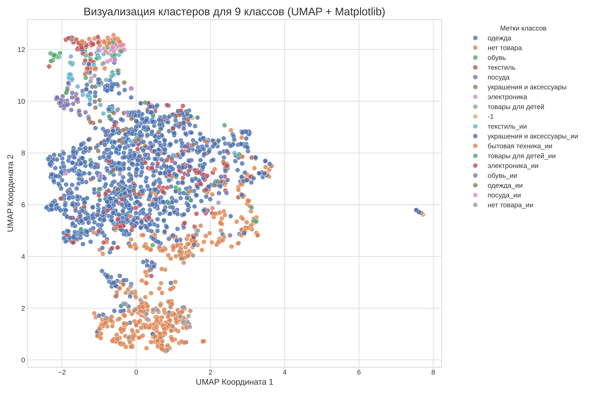

# Классификация категорий товаров по отзывам с помощью LLM

## Цель кейса

Научить LLM-модель классифицировать отзывы по категориям товаров, к которым они относятся.

### Ключевые задачи:
*   **Качество:** Модель должна как можно лучше классифицировать тестовые отзывы по метрике `Weighted F1`.
*   **Скорость:** Время классификации одного примера не должно превышать `5` секунд в среднем.
*   **Категории:** `бытовая техника`, `обувь`, `одежда`, `посуда`, `текстиль`, `товары для детей`, `украшения и аксессуары`, `электроника`, `нет товара`.

## Описание решения

Данное решение представляет собой комплексный пайплайн, который решает проблему классификации отзывов в условиях сильного дисбаланса классов и отсутствия начальной разметки.

Ключевая идея — использовать большую генеративную модель (**Qwen3-14B**) для автоматической разметки и создания качественных синтетических данных, а затем обучить на этих данных более быструю и эффективную encoder-only модель (**xlm-roberta-large**) для финальной классификации.

### Итоговые результаты:
*   **Weighted F1-score на валидационной выборке:** **0.82**
*   **Среднее время инференса на 1 пример (GPU T4): ~0.014 секунды** (что в ~350 раз быстрее требуемого лимита).

## Пайплайн решения

Весь процесс разделен на 5 ключевых этапов, реализованных в предоставленных ноутбуках.

### Этап 1: Автоматическая разметка данных (Zero-Shot Labeling)

Поскольку исходные данные не были размечены, первым шагом стала их автоматическая раз-метка.

1.  **Выбор модели:** После неудачной попытки использования encoder-only модели (`mDeBERTa-v3-base`), которая показала низкую надежность (~40% сомнительных предсказаний), была выбрана мощная decoder-only модель **`Qwen/Qwen3-14B`**.
2.  **Оптимизация:** Для запуска 14B-модели в рамках ограничений Google Colab (16GB VRAM) была использована библиотека `unsloth` с 4-битной квантизацией.
3.  **Промпт-инжиниринг:** Был разработан итеративный промпт со строгой структурой вывода, чтобы обеспечить стабильное и легко парсируемое качество разметки.

**Финальный промпт для разметки:**
```
Ты — точный ИИ-классификатор отзывов. Твоя задача — вернуть категорию и пояснение в СТРОГОМ формате.

**Категории на выбор:**
- бытовая техника
- обувь
- одежда
- посуда
- текстиль
- товары для детей
- украшения и аксессуары
- электроника
- нет товара

**СТРОГИЕ ПРАВИЛА:**
1.  Выбирай категорию "нет товара", если в отзыве говорится только о доставке, оплате, спорах или общих фразах ("все хорошо").
2.  Опирайся ТОЛЬКО на слова в тексте. Не додумывай.
3.  В строке `КАТЕГОРИЯ:` должно быть ТОЛЬКО одно название из списка выше. Никаких лишних слов вроде "среди" или "похоже на".
4.  Твой ответ ДОЛЖЕН СТРОГО следовать формату с метками `КАТЕГОРИЯ:` и `ПОЯСНЕНИЕ:`.

---

**Примеры формата, которому ты должен следовать:**

**Пример 1:**
*Отзыв:* "Платье красивое, но с размером не угадала."
*Твой ответ:*
КАТЕГОРИЯ: одежда
ПОЯСНЕНИЕ: В отзыве упоминается "платье", что напрямую указывает на категорию "одежда".

**Пример 2:**
*Отзыв:* "Посылку так и не доставили, поддержка молчит."
*Твой ответ:*
КАТЕГОРИЯ: нет товара
ПОЯСНЕНИЕ: В отзыве говорится только о проблемах с доставкой, а не о самом товаре.

**Пример 3:**
*Отзыв:* "Купил новые кроссовки для бега, очень удобные."
*Твой ответ:*
КАТЕГОРИЯ: обувь
ПОЯСНЕНИЕ: Ключевое слово "кроссовки" однозначно относится к категории "обувь".
Классифицируй отзыв 
*отзыв*
```
### Этап 2: Анализ данных и выявление проблемы

После разметки был проведен анализ данных с помощью `sbert_large_nlu_ru` для получения эмбеддингов и `UMAP` для визуализации.

*   **Вывод:** Обнаружен **критический дисбаланс классов**. Более 90% отзывов относятся к категориям **"одежда"** и **"нет товара"**. Остальные 7 категорий практически не представлены.
*   **Решение:** Обучение на таких данных приведет к смещенной модели. Было принято решение **сгенерировать синтетические данные** для редких классов.

*   **График 1:** Распределение эмбеддингов только для размеченного train-датасета.
    *   [Ссылка на `original_data.pdf`](/grapics/original_data.pdf)
    *   

### Этап 3: Трехэтапная генерация синтетических данных

Для создания качественных и разнообразных синтетических отзывов был применен трехступенчатый подход с использованием той же модели `Qwen3-14B`.

#### 1. Базовая генерация
Модели предоставлялись несколько "seed" примеров для каждой редкой категории, на основе которых она генерировала новые отзывы.

**Анализ после базовой генерации:**
*   **График 2:** Распределение всех исходных и сгенерированных на первом шаге данных.
    *   [Ссылка на `all_data_initial.pdf`](./grapics/all_data_initial.pdf)
    *   
*   **График 3:** Распределение наиболее надежных исходных данных ("одежда", "нет товара") и всех сгенерированных на первом шаге данных.
    *   [Ссылка на `almost_all_data_initial.pdff`](./grapics/almost_all_data_initial.pdf)
    *   

#### 2. Диверсификация
Чтобы избежать однообразия, сгенерированные отзывы были пропущены через модель еще раз с задачей "перефразировать и изменить стиль", что добавило вариативности.

**Анализ после диверсификации:**
*   **График 4:** Распределение всех исходных и всех сгенерированных (шаги 1+2) данных.
    *   [Ссылка на `all_data_paraphrase.pdf`](./grapics/all_data_paraphrase.pdf)
    *   
*   **График 5:** Распределение надежных исходных и всех сгенерированных (шаги 1+2) данных.
    *   [Ссылка на `almost_all_data_paraphrase.pdf`](./grapics/almost_all_data_paraphrase.pdf)
    *   

#### 3. Стилизация
Для приближения синтетических данных к реальным, модель попросили переписать отзывы, имитируя стиль настоящих отзывов из исходного датасета. Это помогло снизить "bias" синтетики.

**Анализ после стилизации (финальные данные для обучения):**
*   **График 6:** Распределение всех исходных и финальных синтетических данных.
    *   [Ссылка на `all_data_final.pdf`](./grapics/all_data_final.pdf)
    *   
*   **График 7:** Распределение надежных исходных и финальных синтетических данных.
    *   [Ссылка на `almost_all_data_final.pdf`](./grapics/almost_all_data_final.pdf)
    *   
### Этап 4: Обучение итоговой модели

Для финальной классификации была выбрана модель **`xlm-roberta-large`** как эффективное и мощное решение для задачи понимания текста.

*   **Данные для обучения:** Использовались все реальные размеченные отзывы, дополненные сгенерированными отзывами **только для редких классов**.
*   **Борьба с дисбалансом:** Для учета оставшегося дисбаланса классов был использован `CustomTrainer` с взвешенной функцией потерь (`CrossEntropyLoss`), который назначает больший вес ошибкам на редких классах.
*   **Обучение:** Модель была полностью дообучена (full fine-tuning) в течение 5 эпох.

Веса лучшей модели доступны по ссылке  (они не влезли в гит, а спецхранилище для весов у меня и так забито)

### Этап 5: Оценка и инференс

Обученная модель была оценена на отложенной тестовой выборке.

**Отчет по классификации (Classification Report):**
```
                        precision    recall  f1-score   support

       бытовая техника       0.60      0.86      0.71         7
            нет товара       0.91      0.87      0.89        98
                 обувь       0.67      0.57      0.62        14
                одежда       0.92      0.86      0.89       222
                посуда       0.71      0.56      0.63         9
              текстиль       0.48      0.62      0.54        40
      товары для детей       0.53      0.80      0.64        10
украшения и аксессуары       0.56      0.91      0.69        11
           электроника       0.83      0.56      0.67         9

              accuracy                           0.81       420
             macro avg       0.69      0.73      0.70       420
          weighted avg       0.84      0.81      0.82       420
```
Матрица ошибок:

Как видно из отчета, модель хорошо справляется с доминирующими классами и показывает приемлемое качество на редких, хотя путает близкие категории, такие как "одежда" и "текстиль" (что в некоторых случаях связано больше с качеством разметки)

## Потенциальные улучшения

*   **Более мощные модели:** Использование моделей большего размера (например, 70B) для этапа разметки и генерации может дать более качественные синтетические данные.
*   **Улучшенный промптинг:** Дальнейшая итерация над промптами для генерации, возможно, с более сложными примерами и правилами.
*   **Дистилляция знаний:** Вместо обучения отдельной encoder-модели можно попробовать дистиллировать знания из большой `Qwen3-14B` в меньшую decoder-модель, чтобы она научилась стабильно выдавать только название класса.
*   **Активное обучение:** Внедрение цикла активного обучения, где модель помечает наиболее неуверенные примеры для дополнительной проверки или генерации.


